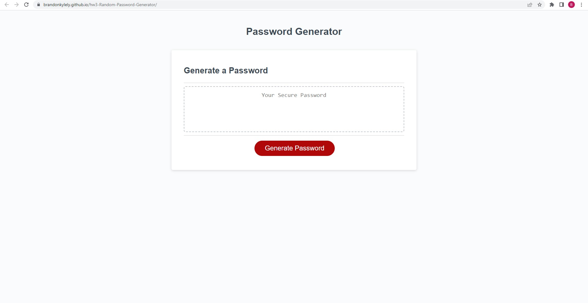

# 03 JavaScript: Password Generator

## Description

This code will generate a random password. There will be 4 categories of characters that the user can choose to include or exclude, and it will generate between 8-128 characters decided by the user. 

## Usage

Follow the prompts to confirm whether or not you would like uppercase letters, lowercase letters, numbers, and/or special characters. Enter a number between 8-128 to chooose password length. Attempting to enter a number not within 8 and 128 will notify the user to enter a different number.

## Example Screenshot

## Site URL

https://brandonkylely.github.io/hw3-Random-Password-Generator/

## Contact

You can reach me at brandonkly@ucla.edu.

